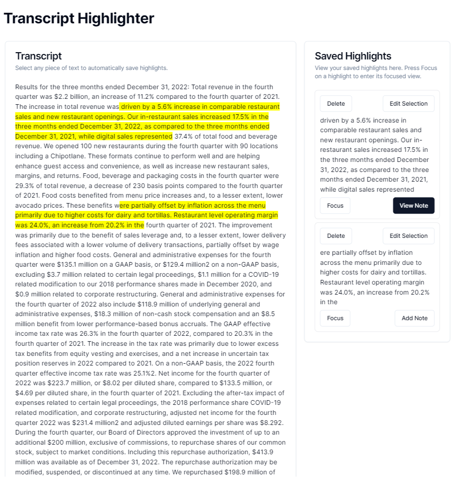
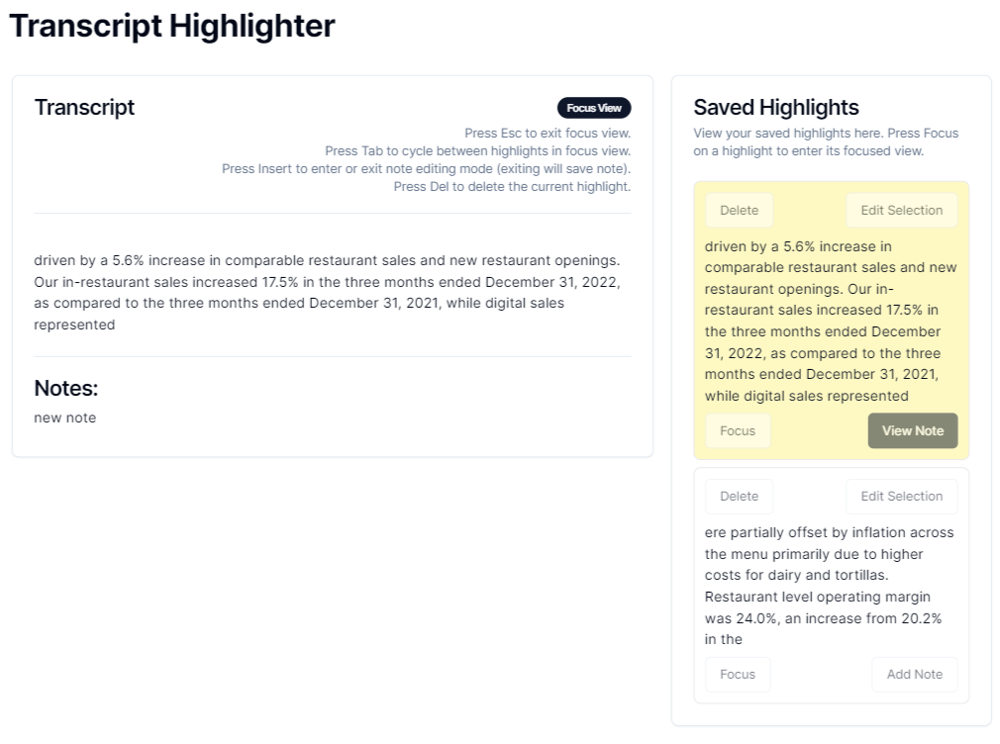

# Quilt Labs Assessment




## Getting Started

Be sure to install all the dependencies:

```bash
npm install
```

First, run the development server:

```bash
npm run dev
```

Open [http://localhost:3000](http://localhost:3000) with your browser to see the result.

## Requirements

- Highlighting:

  - [x] quick and intuitive
  - [x] option to add a note
  - [x] upon creation, it should appear in saved highlights section

- Updating highlights:

  - [x] delete w/ confirmation
  - [x] modify the range

- Notes:

  - [x] add note
  - [x] update note
  - [x] remove note w/ confirmation

- View previous highlights:

  - [x] selecting a saved highlight will only show the highlighted section on the transcript. note should be shown as well
    - when viewing, user should be able to:
      - [x] delete highlight
      - [x] make/edit a note with keyboard shortcuts
  - [x] user should be able to cycle thru their saved highlights with "tab"
  - [x] user should be able to exit the focused view using "esc"

- Documentation:
  - Tricky problems:
    - creating highlighted portions on the transcript was tricky without having to format the data myself. I had to remove the element tags and just incorporate it as one block of text. Because I used surroundContents to wrap text with a mark tag, it would run into issues if there were non-text entities within the text selection. This also allowed me to get the ranges more reliably as well.
      - the highlighted portions were also tricky to keep track of and delete, since they exist outside of the React state. I had to create a simple id generator, which was just a counter, to assign a data attribute to the mark elements. I then had to include that id in each saved highlight object.
    - initially, I started off with simple state management since I was working more additively. But prop drilling became an issue as more and more data needed to be passed around to sync the transcript and the savedHighlights sections. I used jotai to provide a context-like environment.
      - the more I was adding features into the savedHighlights cards like editing range, deleting, and editing notes, I realized that they were simiilar features required when you're in focused view with a single highlight. Making sure that both components were updated and consistent was tricky, and efficient state management and custom hooks helped with that.
    - figuring out the best way to incorporate keyboard shortcuts were tricky at first, from a UX pov. I wanted to use one-key commands for simplicity's sake, so I had to think of which keys would not normally be used while typing. Since it's used to activate note editing, an alphanumeric or modifier key would've been an issue. I used insert in this case.
      - due to the number of keyboard commands required, I make a custom hook to generalize the event listeners for each key.
  - Testing:
    - since it was mostly frontend, I used Chrome debugging tools, console logs, and React developer tools to monitor state and rendering.
  - include what else you would want to implement if you had more time (additional features, refactors, etc).
    - I would've liked to incorporate more UI around the highlighted text portions in the transcript. All of my interactions are done via the saved highlights component cards or the text area.
    - This way, it might've been cleaner to have all the UI buttons on the highlighted text area, rather than have the cards have so many buttons.
    - I also would've liked to have more indicators for which highlighted text corresponded to which card on the saved highlights section. For now, I only have one color for the highlighted text, and no identifiers to match it with a card. I likely probably color code the highlighted text to the background color of the card.
    - I would've liked to incorporate formatting of the transcript data to both preserve the original layout but also allow the highlighting function to work robustly. Currently, I had to get rid of the element tags so that I could more easily manipulate the elements without running into issues.
    - I also didn't really spend time thinking about responsiveness and how the UI elements would stack with smaller screens, so I would've liked to have another iteration on the UI.
  - instructions for to run the app, like additional libraries
    - I used:
      - shadcn for the baseline compoonent libraries
      - jotai for lightweight state management.
    - Be sure to install those dependencies, and npm run dev to run the app.
    - Note: since there's no data persistence, the data is only stored on the component level, so refreshing will reset the state values.
